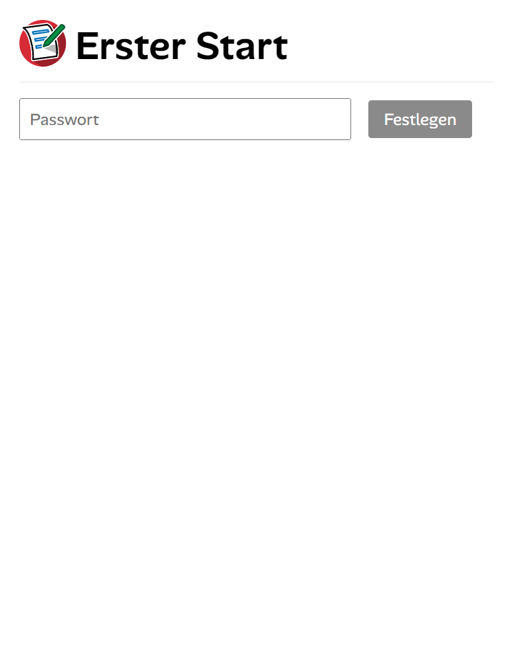
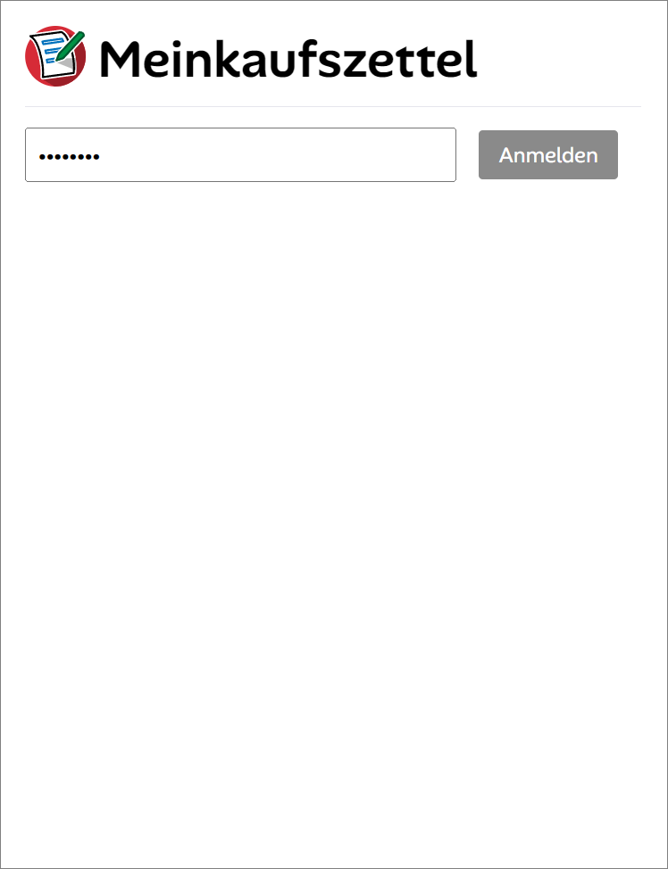
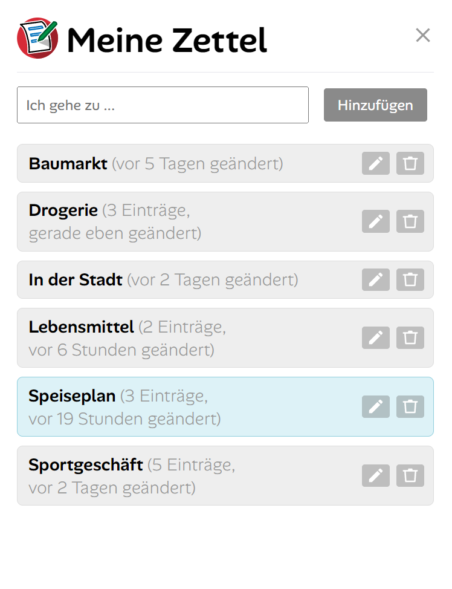
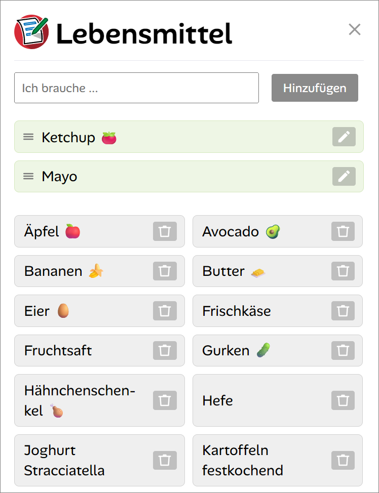
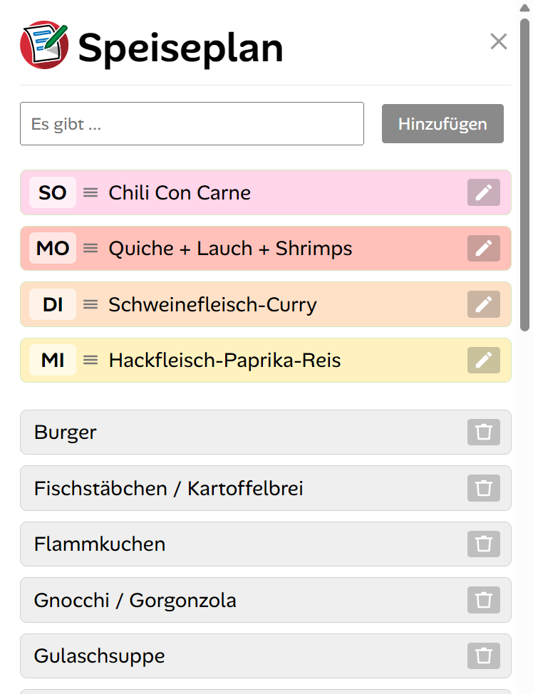

#  Meinkaufszettel
# Meinkaufszettel 🛒

Eine schlanke, selbst-gehostete Web-App für gemeinsame Einkaufslisten und Notizen – entwickelt mit Fokus auf Privatsphäre, Einfachheit und Zusammenarbeit in Echtzeit.

## ✨ Highlights

- **📱 Progressive Web App**: Funktioniert wie eine native App auf Smartphone, Tablet und Desktop
- **🔄 Echtzeit-Synchronisation**: Mehrere Personen können gleichzeitig an einer Liste arbeiten
- **🔐 Privatsphäre-first**: Selbst-gehostet, keine externe Cloud, volle Kontrolle über deine Daten
- **🎨 Speiseplan-Modus**: Spezielle Funktion für Wochenpläne mit farblicher Kennzeichnung
- **📤 Listen teilen**: Einfaches Teilen via Link – ohne komplizierte Freigaben
- **⚡ Ohne Datenbank**: Läuft mit reinen Dateien, minimal und wartungsarm

## 🚀 Features

### Listenverwaltung
- Beliebig viele Listen für verschiedene Zwecke (Einkauf, To-Do, Projekte...)
- Drag & Drop zum Sortieren der Einträge
- Einträge mit `!` oder `?` für Prioritäten markieren
- Such-Dropdown mit Live-Vorschlägen aus bestehenden Einträgen
- Automatische alphabetische Sortierung erledigter Einträge

### Zusammenarbeit
- **Geteilte Listen**: Sende einen Share-Link an andere Nutzer
- **Live-Sync**: Änderungen erscheinen automatisch bei allen Beteiligten
- **Hardlink-Technologie**: Geteilte Listen bleiben konsistent über alle Konten

### Benutzerfreundlichkeit
- **5-Sekunden-Undo**: Versehentlich gelöschte/abgehakte Einträge rückgängig machen
- **Touch-optimiert**: Perfekt bedienbar auf Smartphones
- **Inaktivitäts-Timer**: Kehrt automatisch zur Übersicht zurück
- **Barrierearm**: Tastaturnavigation, ARIA-Labels, semantisches HTML

### Sicherheit & Datenschutz
- **Einladungs-System**: Neue Konten nur via Invite-Token
- **Passwort-Reset**: Über E-Mail (optional konfigurierbar)
- **Session-basiert**: Sichere Cookie-Authentifizierung
- **DSGVO-konform**: Datenexport und Account-Löschung eingebaut
- **Path-Traversal-Schutz**: Robuste Sicherheitsvalidierung

## 📋 Voraussetzungen

- PHP 7.4+ (mit `password_hash`, `json`, `session`)
- Webserver (Apache, Nginx, Lighttpd...)
- Schreibrechte im `data/`-Verzeichnis
- Optional: `mail()`-Funktion für Passwort-Reset

**Keine Datenbank erforderlich!**

## 🛠️ Installation

### 1. Repository klonen
```bash
git clone https://github.com/zenziwerken/Meinkaufszettel.git
cd Meinkaufszettel
```

### 2. Verzeichnisse erstellen
```bash
mkdir -p data/{user,invites,shares,resets,tmp}
chmod 750 data data/user data/invites data/shares data/resets data/tmp
```

### 3. Webserver konfigurieren

**Apache (.htaccess ist bereits enthalten)**
```apache
<Directory /pfad/zu/Meinkaufszettel>
    AllowOverride All
    Require all granted
</Directory>
```

**Nginx**
```nginx
location / {
    try_files $uri $uri/ /index.php?$args;
}

location ~ \.php$ {
    include snippets/fastcgi-php.conf;
    fastcgi_pass unix:/run/php/php-fpm.sock;
}

location /data/ {
    deny all;
}
```

### 4. Konfiguration anpassen

Bearbeite `bin/config.php`:
```php
// CORS-Domains für API-Zugriff
$allowedOrigins = [
    'https://deine-domain.de'
];

// Admin-User (dürfen Einladungen erstellen)
$adminUsers = [
    'admin-username'
];

// E-Mail-Einstellungen für Passwort-Reset
$resetTokenExpiry = 3600; // 1 Stunde
```

### 5. Erste Anmeldung

1. Rufe die App im Browser auf
2. Der "Erster Start"-Banner erscheint mit einem automatisch generierten Invite-Link
3. Klicke auf den Link und lege dein Konto an
4. Fertig! 🎉

## 📱 Als PWA installieren

### Android/iOS
1. Öffne die App im Browser
2. Tippe auf das Menü (⋮ bzw. ⎙)
3. Wähle "Zum Startbildschirm hinzufügen"

### Desktop (Chrome/Edge)
1. Klicke auf das ⊕-Symbol in der Adressleiste
2. Oder: Einstellungen → "App installieren"

## 🎨 Speiseplan-Feature

Listen mit dem Namen **"Speiseplan"** erhalten automatisch:
- Farbcodierung nach Wochentagen (Mo–So)
- Automatisches Wechseln zum nächsten Tag um 20 Uhr
- Spezielle Darstellung für Essensplanung

Anpassbar in `bin/config.php`:
```php
$speiseplanName = 'Speiseplan';
$dayNames = ["MO", "DI", "MI", "DO", "FR", "SA", "SO"];
$colors = [...]; // HEX-Farben
```

## ⚙️ Erweiterte Konfiguration

### Limits anpassen
```php
$maxItemsPerList = 200;    // Max. Einträge pro Liste
$maxItemLength = 200;      // Max. Zeichen pro Eintrag
$syncInterval = 40000;     // Auto-Sync-Intervall (ms)
$inactivityTimeoutMs = 600000; // Inaktivitäts-Timeout (ms)
```

### Cleanup-Zeiten
```php
$userTokenCleanupDays = 60;    // Alte Session-Tokens
$invalidResetKeepDays = 30;    // Reset-Tokens
$challengeMaxAgeDays = 365;    // Challenge-Dateien
```

## 🔧 Wartung

### Alte Dateien aufräumen
Erstelle einen Cronjob für `bin/cleanup.php` (wenn vorhanden):
```bash
0 3 * * * cd /pfad/zu/Meinkaufszettel && php bin/cleanup.php
```

### Backup
```bash
# Vollständiges Backup
tar -czf backup-$(date +%Y%m%d).tar.gz data/ bin/config.php

# Nur Benutzerdaten
tar -czf userdata-$(date +%Y%m%d).tar.gz data/user/
```

### Updates
```bash
git pull origin main
# Prüfe bin/config.php auf neue Optionen
```

## 📖 Nutzung

### Listen verwalten
- **Neue Liste**: "Ich gehe zu ..." → "Hinzufügen"
- **Liste teilen**: 📤-Symbol → Link wird kopiert
- **Liste umbenennen**: ✏️-Symbol neben dem Namen
- **Liste löschen**: 🗑️-Symbol (mit Bestätigung)

### Einträge verwalten
- **Hinzufügen**: "Ich brauche ..." → "Hinzufügen"
- **Sortieren**: Drag & Drop am ☰-Symbol
- **Abhaken**: Auf Eintrag klicken (verschiebt nach unten)
- **Reaktivieren**: Auf abgehakten Eintrag klicken
- **Löschen**: 🗑️-Symbol (mit 5-Sek-Undo)

### Wichtige/unwichtige Einträge
- `Eintrag!` → Roter Rahmen, fettgedruckt
- `Eintrag?` → Grauer Rahmen

## 🔐 Sicherheitshinweise

1. **HTTPS verwenden**: Let's Encrypt für kostenloses SSL/TLS
2. **data/ schützen**: Darf nicht öffentlich erreichbar sein
3. **PHP aktuell halten**: Sicherheitsupdates einspielen
4. **Starke Passwörter**: Mind. 6 Zeichen (besser 12+)
5. **Backup-Strategie**: Regelmäßige Backups des `data/`-Verzeichnisses


## 📄 Lizenz

MIT License - siehe [LICENSE](LICENSE) Datei für Details.

## 🙏 Credits

- **Icons**: Tabler Icons
- **Font**: Alan Sans (Open Source)
- **Hintergrund**: Streamline (Plump Line - Food & Drink)

## 📞 Support & Kontakt

- **Issues**: [GitHub Issues](https://github.com/zenziwerken/Meinkaufszettel/issues)
- **Diskussionen**: [GitHub Discussions](https://github.com/zenziwerken/Meinkaufszettel/discussions)

---

**Hinweis**: Diese App ist für den privaten/familiären Gebrauch optimiert. Für große Teams oder öffentliche Instanzen empfiehlt sich eine professionelle Datenbank-Lösung.

---

**Viel Spaß beim Organisieren! 🎉**

# Screenshots
        
